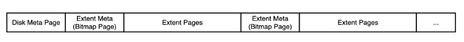

# 0.模块分工

1. DISK AND BUFFER POOL MANAGER：刘奕骁+薛捷捷
2. RECORD MANAGER：夏恩博
3. INDEX MANAGER：刘奕骁+薛捷捷
4. CATALOG MANAGER：李予谦
5. SQL EXECUTOR：刘奕骁+薛捷捷+夏恩博+李予谦

# 1.总体设计

## 1.1 系统架构概述

- 在系统架构中，解释器`SQL Parser`在解析SQL语句后将生成的语法树交由执行器`Executor`处理。执行器则根据语法树的内容对相应的数据库实例（`DB Storage Engine Instance`）进行操作。
- 每个`DB Storage Engine Instance`对应了一个数据库实例（即通过`CREATE DATABSAE`创建的数据库）。在每个数据库实例中，用户可以定义若干表和索引，表和索引的信息通过`Catalog Manager`、`Index Manager`和`Record Manager`进行维护。目前系统架构中已经支持使用多个数据库实例，不同的数据库实例可以通过`USE`语句切换（即类似于MySQL的切换数据库），在初步实现时，可以先考虑单个数据库实例的场景，在单个实例跑通后再支持多个实例。


## 1.2 系统模块概述

### 1.2.1 Disk Manager

- Database File（DB File）是存储数据库中所有数据的文件，其主要由记录（Record）数据、索引（Index）数据和目录（Catalog）数据组成（即共享表空间的设计方式）。与书上提供的设计（每张表通过一个文件维护，每个索引也通过一个文件维护，即独占表空间的设计方式）有所不同。共享表空间的优势在于所有的数据在同一个文件中，方便管理，但其同样存在着缺点，所有的数据和索引存放到一个文件中将会导致产生一个非常大的文件，同时多个表及索引在表空间中混合存储会导致做了大量删除操作后可能会留有有大量的空隙。
- Disk Manager负责DB File中数据页的分配和回收，以及数据页中数据的读取和写入。

### 1.2.2 Buffer Pool Manager

- Buffer Manager 负责缓冲区的管理，主要功能包括：

1. 1. 根据需要，从磁盘中读取指定的数据页到缓冲区中或将缓冲区中的数据页转储（Flush）到磁盘；
   2. 实现缓冲区的替换算法，当缓冲区满时选择合适的数据页进行替换；
   3. 记录缓冲区中各页的状态，如是否是脏页（Dirty Page）、是否被锁定（Pin）等；
   4. 提供缓冲区页的锁定功能，被锁定的页将不允许替换。

- 为提高磁盘 I/O 操作的效率，缓冲区与文件系统交互的单位是数据页（Page），数据页的大小应为文件系统与磁盘交互单位的整数倍。在本实验中，数据页的大小默认为 4KB。

### 1.2.3 Record Manager

- Record Manager 负责管理数据表中记录。所有的记录以堆表（Table Heap）的形式进行组织。Record Manager 的主要功能包括：记录的插入、删除与查找操作，并对外提供相应的接口。其中查找操作返回的是符合条件记录的起始迭代器，对迭代器的迭代访问操作由执行器（Executor）进行。
- 堆表是由多个数据页构成的链表，每个数据页中包含一条或多条记录，支持非定长记录的存储。不要求支持单条记录的跨页存储（即保证所有插入的记录都小于数据页的大小）。堆表中所有的记录都是无序存储的。
- 需要额外说明的是，堆表只是记录组织的其中一种方式，除此之外，记录还可以通过顺序文件（按照主键大小顺序存储所有的记录）、B+树文件（所有的记录都存储在B+树的叶结点中，MySQL中InnoDB存储引擎存储记录的方式）等形式进行组织。学有余力的同学可以尝试着使用除堆表以外的形式来组织数据。

### 1.2.4 Index Manager

- Index Manager 负责数据表索引的实现和管理，包括：索引（B+树等形式）的创建和删除，索引键的等值查找，索引键的范围查找（返回对应的迭代器），以及插入和删除键值等操作，并对外提供相应的接口。
- B+树索引中的节点大小应与缓冲区的数据页大小相同，B+树的叉数由节点大小与索引键大小计算得到。

### 1.2.5 Catalog Manager

- Catalog Manager 负责管理数据库的所有模式信息，包括：

1. 1. 数据库中所有表的定义信息，包括表的名称、表中字段（列）数、主键、定义在该表上的索引。
   2. 表中每个字段的定义信息，包括字段类型、是否唯一等。
   3. 数据库中所有索引的定义，包括所属表、索引建立在那个字段上等。

- Catalog Manager 还必需提供访问及操作上述信息的接口，供执行器使用。

### 1.2.6 Executor

- Executor（执行器）的主要功能是根据解释器（Parser）生成的语法树，通过Catalog Manager 提供的信息生成执行计划，并调用 Record Manager、Index Manager 和 Catalog Manager 提供的相应接口进行执行，最后通过执行上下文将执行结果返回给上层模块。

# 2.个人模块

## Buffer Pool Manager

### LRU Replacer(刘奕骁)

Least Recently Used算法，将最近最少使用的数据页回收。具体的实现是一个队列（实际上是双向链表），队列容量为内存能容纳的最大数据页数。将内存中已经不再引用的数据页号丢进队列，当内存满了，需要回收一个页来开辟出新空间时，把队列最里面（最早丢进去）的页号对应的页给回收了。当复用队列中的页时，将其从队列中取出，用完后重新丢进队列。

```c++
private:
  // 一个双向链表来实现lru_list_，可以认为大小上限为num_pages
  list<int> deque;
  // 一个哈希表来将frame_id和队列中的节点指针对应，用来减少在双向链表中查找和定位的复杂度
  unordered_map<int, list<int>::iterator> map;
```

看起来是一个deque能够解决的问题，然而实际上复用队列中的页时，我们需要去里面遍历找它，然后取出来，连接其前后节点。为了降低查找的复杂度，加上哈希表实现。map<key, LinkedNode>将key直接映射到deque中的链表节点，这样查找就变成了$O(1)$。

参考了 [LRU Cache Implementation - GeeksforGeeks](https://www.geeksforgeeks.org/lru-cache-implementation/?ref=leftbar-rightbar)。

### Clock Replacer(李予谦)

时钟置换算法可以认为是一种最近未使用算法，即逐出的页面都是最近没有使用的那个。将所有的buffer page环绕成一圈，并把status置为true。当需要Victim的时候就用指针旋转，找到第一个status=false的节点，沿途如果遇到status=true的节点，就将其status置为false。

```c++
//用来储存一个ClockNode
struct ClockNode{
 public:
  //该节点目前是否已经启用
  bool isNull = true;
  //该节点的时钟状态
  bool node_status = true;
  //该节点对应的页号
  frame_id_t frame_id = 0;
};
typedef struct ClockNode cnode;
```

需要注意的是，一旦有page被Unpin了，就需要将其初始化到指针的前面，使得他不会立马在下一轮victim中成为第一个被检查的page，因为这不符合最近未使用算法的原则。

> **reference:**[Clock Replacer Algorithm in C++ – Andrew Wei – Brown '21 - Computer Science ScB (andrew128.github.io)](https://andrew128.github.io/ClockReplacer/)

### Disk Manager(薛捷捷)

有了bitmap之后，我们可以很方便地使用一个位图页加上一段连续的数据页（数据页的数量取决于位图页最大能够支持的比特数）来对磁盘文件（DB File）中数据页进行分配和回收。为了扩充我们可以表示的磁盘空间，将一个位图页加一段连续的数据页看成数据库文件中的一个分区（Extent），再通过一个额外的元信息页来记录这些分区的信息。通过这种“套娃”的方式，来使磁盘文件能够维护更多的数据页信息，实现如下图所示。



此外，再通过一次转换，只考虑实际保存数据的Extent Pages，使用与实际物理地址映射的虚拟page id，可以将数据页连续的呈现给上层Buffer Poll。

### Buffer Pool Manager(刘奕骁)

其他函数并不直接和Disk交互，而是都通过Buffer Pool，Buffer Pool Manager根据需求将硬盘中的数据拉取到内存中，供调用者使用。

#### FetchPage

1. 如果内存里还留有这个page，直接取，并把它从lru淘汰队列中拿出来（如果在里面的话）。
2. 如果内存里没有，那么看看free_list_还有没有空余的内存空间，如果有，用这个空间从disk拉取。
3. 如果free_list_没有空余空间，那么内存已满，从lru淘汰一个页，获取自由空间，从disk拉取。注意，lru淘汰的页如果是被修改过（dirty）的，那么应该把它写入disk而不是直接丢掉。递增pin\_count\_。
4. 如果lru也没东西可淘汰，那就返回nullptr。

#### NewPage

1. 如果free_list_有空间，从内存中直接用空闲空间存放新页。
2. 如果free_list_没空间，那么内存满了，尝试从lru淘汰一个，留出空间。
3. 如果lru也没东西可淘汰，那就返回nullptr。
4. 在disk里分配空间，获取到逻辑页号。设置新页的pin\_count\_为1。
5. 将页号在引用参数中传回，将内存开辟的页return。

#### UnpinPage

注意，这里Unpin的时候会传入是否dirty，也就是调用者是否修改过这个数据页。显然应该使

***这个page的is\_dirty\_ = 这个page的is\_dirty\_ || is\_dirty\_***

因为可能有多重调用，只要有一重调用是dirty的，那么它就是dirty的。

判断完dirty后，使pin\_count\_--，当pin\_count\_为0时，将它放进lru淘汰队列。

#### DeletePage

给的原本的注释存在一些问题，实际情况应该为：

1. 如果这个页不在内存里，直接从硬盘里删除。
2. 如果这个页在内存里而且pin\_count\_>0，无法删除，返回false。
3. 如果这个页在内存里而且pin\_count\_==0，也就是在lru淘汰队列中，那么直接从淘汰队列里删除，把内存里的空间清理出来，最后从硬盘里删除。

#### pin_count_

当且仅当pin\_count\_为0时，一个page会被纳入lru的管理，等待合适的时机将它回收。在每一次FetchPage和NewPage时，我们都使该page的pin\_count\_++，而在UnpinPage时令pin\_count\_--。为了维护好pin\_count\_的值，如果一个方法并不生产出Page*供其他方法使用，那么它应该在内部使用完fetch或new得到的page后，及时地unpin它。如果一个方法用fetch和new获得满足特定条件的page提供给调用者，那么应该由调用者来unpin它。

## Record Manager(夏恩博)

###  MemHeap

首先，我们为什么在这里需要有一个MemHeap？它和普通的`malloc`、`free`管理空间有什么不同？

这里其实只是一个统一化的内存管理模式。比如一个Row对象，我们发现在它的构造函数中，每次构造都直接new SimpleMemHeap作为自己的heap\_，也就是说每一个Row都独立享有一个MemHeap，而它的内存都交给它来管理。当需要delete一个Row时，我们看\~Row() => \~SimpleMemHeap() => 将MemHeap中所有空间都安全地释放掉。这样统一的内存释放防止了程序员编码不严谨带来的内存泄漏。

另外，第二章比较主要的内容就是序列化与反序列化了，所以先进行一波简单的介绍。

###  Serialize (序列化)

简单来说，就是将我们minisql中的`row`、`column`、`schema`、`field`等对象以字节流(char*)的方式储存在硬盘中，使他被持续化地储存，并可以在需要时通过反序列化操作读出我们想要的数据。

例子：

```cpp
void SerializeA(char *buf, A &a) {
    // 将id写入到buf中, 占用4个字节, 并将buf向后推4个字节
    WriteIntToBuffer(&buf, a.id, 4);
    WriteIntToBuffer(&buf, strlen(a.name), 4);
    WriteStrToBuffer(&buf, a.name, strlen(a.name));
}
```

###  Deserialize (反序列化)

反序列化就是从disk中读出所存的内容，将以char方式存在disk中的数据读出并存到`row`、`column`、`schema`、`field`等对象中。总得来说，序列化与反序列化操作是对称的，具体实现可以看代码。

例子：

```cpp
void DeserializeA(char *buf, A *&a) {
    a = new A();
    // 从buf中读4字节, 写入到id中, 并将buf向后推4个字节
    a->id = ReadIntFromBuffer(&buf, 4);
    // 获取name的长度len
    auto len = ReadIntFromBuffer(&buf, 4);
    a->name = new char[len];
    // 从buf中读取len个字节拷贝到A.name中, 并将buf向后推len个字节
    ReadStrFromBuffer(&buf, a->name, len);
}
```

###  Rowid

对于数据表中的每一行记录，都有一个唯一标识符`RowId`（`src/include/common/rowid.h`）与之对应。`RowId`同时具有逻辑和物理意义，在物理意义上，它是一个64位整数，是每行记录的唯一标识；而在逻辑意义上，它的高32位存储的是该`RowId`对应记录所在数据页的`page_id`，低32位存储的是该`RowId`在`page_id`对应的数据页中对应的是第几条记录，即`slot_num`。

###  Table Heap

简单来说，一个table heap里面以双向链表的方式储存了许多的table page，而table page里又存了一个又一个的row。此时要想定位一个row，就需要用到我们说的rowid了，通过高32位获取page_id，低32位获取在该page中的位置。	

###  TableHeap:InsertTuple(&row, *txn)

传入要插入的row的指针，我们遍历整个tableheap中的所有page，找到容纳该row的位置并插入，同时用该插入位置生成rowid赋值给row指针，从而实现输出的效果。若成功插入就返回true，否则输出false。

###  TableHeap:UpdateTuple(&new_row, &rid, *txn)

将`RowId`为`rid`的记录`old_row`替换成新的记录`new_row`，并将`new_row`的`RowId`通过`new_row.rid_`返回。

*这里在实现的时候由于助教改了需求，所以目前有一些小的瑕疵，但我决定最后debug需要修改时再说（*

###  TableHeap:ApplyDelete(&rid, *txn)

```
// Step1: Find the page which contains the tuple.
// Step2: Delete the tuple from the page.
// Find the page which contains the tuple.
```

很简单，没啥好说的

###  TableHeap:GetTuple(*row, *txn)

获取`RowId`为`row->rid_`的记录，同样没啥好说的

###  TableIterator

堆表记录迭代器是可以遍历整个heap中所有page的所有row的迭代器，通过iterator++来移动迭代器达到遍历heap的效果。

```cpp
class TableHeap;

class TableIterator {

public:
  // you may define your own constructor based on your member variables
  explicit TableIterator(TableHeap * t,RowId rid);

  explicit TableIterator(const TableIterator &other);

  virtual ~TableIterator();

  bool operator==(const TableIterator &itr) const;

  bool operator!=(const TableIterator &itr) const;

  const Row &operator*();

  Row *operator->();

  TableIterator &operator++();

  TableIterator operator++(int);

private:
  // add your own private member variables here
  TableHeap* table_heap_;
  Row* row_;
};
```

###  TableIterator &TableIterator::operator++()

有点复杂，有以下几步

1. 若当前已经是tableheap的end，则直接返回end()
2. 先找与当前iter**同page且未被删除**的row，找不到跳到3
3. 切换到下一个page，若当前已经是最后一页跳到4，否则跳回2
4. 返回end()

### TableIterator TableHeap::Begin(Transaction *txn)

获取堆表的首条记录，作为初始迭代器

### TableIterator TableHeap::End()

用INVALID_ROWID标注end,此时rowid=(page_id,slot_id)=(-1,0)

```c++
TableIterator TableHeap::End() {
  return TableIterator(this,INVALID_ROWID);
}
```

### 本模块的注意事项

+ 用到了bufferpool中的许多函数

+ 许多基本功能其实都已经由tablepage写好，我的工作主要是加了许多逻辑的判断

+ 在读写page前都需要上锁,完成后解锁并unpinpage。 RLatch()、RULatch()、WLatch()、WULatch()、buffer_pool_manager_->UnpinPage（）


## Index Manager

### BPlusTree(刘奕骁)

因为B+树内部的方法调用链过于繁多复杂，这里对其创建、插入、查找、删除的流程仅做概述。

#### 创建

我们看到

```c++
BPlusTree(index_id_t index_id, BufferPoolManager *buffer_pool_manager, const KeyComparator &comparator, int leaf_max_size, int internal_max_size)
    : index_id_(index_id),
      buffer_pool_manager_(buffer_pool_manager),
      comparator_(comparator),
      leaf_max_size_(leaf_max_size),
      internal_max_size_(internal_max_size);
```

构造函数中，传入了index_id，这是在catalog中记录的索引信息，在config中，我们规定了`INDEX_ROOTS_PAGE_ID`为固定值，于是在初始化时，去`index_roots_page`中寻找是否有此index_id的对应树根，如果有，初始化`root_page_id`。否则让`root_page_id`为`INVALID_PAGE_ID`。

#### 插入

```c++
INDEX_TEMPLATE_ARGUMENTS
bool BPLUSTREE_TYPE::Insert(const KeyType &key, const ValueType &value, Transaction *transaction) {
  bool res = false;
  if (IsEmpty()) {
    StartNewTree(key, value);
    res = true;
  } else {
    res = InsertIntoLeaf(key, value, transaction);
  }
  return res;
}
```

这里的入口逻辑还是非常简单的，没根则建根，有根则插入。我们看看插入是怎么做的：

+ 二分查找内部节点，找到可能所在的孩子，递归查找孩子，直到叶子节点。
+ 如果叶子节点还没满，直接插入。注意插入时，如果插入了叶子的第一个位置，那么需要更新父亲的对应key。
+ 如果叶子满了，将叶子拆成两半，将新的node插入合适的一半中。这里需要注意的是，一方面拆成两半时需要向父亲节点插入一个新pair，另一方面记得维护叶子节点串成的链表，保持B+树可顺序遍历叶子的特性。

#### 查找

```c++
INDEX_TEMPLATE_ARGUMENTS
bool BPLUSTREE_TYPE::GetValue(const KeyType &key, std::vector<ValueType> &result, Transaction *transaction) {
  auto leaf_page = FindLeafPage(key);
  if (leaf_page == nullptr) return false;
  auto leaf = reinterpret_cast<B_PLUS_TREE_LEAF_PAGE_TYPE *>(leaf_page->GetData());
  bool res = false;
  if (leaf != nullptr) {
    ValueType value;
    if (leaf->Lookup(key, value, comparator_)) {
      result.push_back(value);
      res = true;
    }
  }
  buffer_pool_manager_->UnpinPage(leaf->GetPageId(), false);
  return res;
}
```

十分简单的处理，二分查找内部节点，找到可能所在的孩子，递归查找孩子，直到叶子节点。最后在叶子节点里二分查找。

#### 删除

+ 查找到响应的叶子节点，从叶子节点中将其删除
+ 如果此叶子节点并非根（即有父亲），并且删除的位置为第一个，那么需要更新父亲节点中的key。
+ 如果删除后叶子节点少于最小size，启动以下策略：
  + 找到兄弟节点，如果兄弟节点和本人合并size超标，则只从兄弟那里挪过来一个。
  + 如果兄弟节点和本人合并size不超标，则合并。


#### b_plus_internal_page

中间节点类，需要注意的是这里采用的internal node策略是第一个key为invalid。

#### b_plus_leaf_page

叶子节点类，key和value完全成对匹配。

#### 泛型的方法参数匹配

原本的框架有这样令人不快的地方：我们常常需要用泛型N来同时操作internal node和leaf node，然而在使用他们的方法时，却会遇到方法签名不一致的情况：

+ void BPlusTreeLeafPage::MoveAllTo(BPlusTreeLeafPage *recipient);
+ void BPlusTreeInternalPage::MoveAllTo(BPlusTreeInternalPage *recipient, BufferPoolManager *buffer_pool_manager);

于是我们可以增加无用的参数来让泛型签名吻合 =>

+ void BPlusTreeLeafPage::MoveAllTo(BPlusTreeLeafPage *recipient, const KeyType &, BufferPoolManager *);

### index iterator(薛捷捷)

为B+树索引实现迭代器。该迭代器能够将所有的叶结点组织成为一个单向链表，然后沿着特定方向有序遍历叶结点数据页中的每个键值对（可以用于范围查询）。

实现了`begin()`,  `begin(const KeyType &key)`, `end()`三种构造方法，其中`begin(const KeyType &key):`

```c
/*
 * Input parameter is low key, find the leaf page that contains the input key
 * first, then construct index iterator
 * @return : index iterator
 */
```

在`Index Iterator`类中会保存由`BPlusTree`构建Iterator时传入的`BPlusTree`指针，一方面可以用来提供泛型的`comparator`与`buffer pool manager_`，另一方面可以用于唯一标识`Iterator.end()`。

## Catalog Manager（李予谦）

Catalog Manager这个模块的核心要义就是完成```CatalogManager```类，该类将作为Part5 Executor与前面三个part的桥梁使用。

### 结构示意

**CatalogManager**

- CatalogMetaData
  - Index_meta_data_page(used to reload catalog)
  - table_meta_data_page(used to reload catalog)
- many kinds of maps
  - IndexInfo
    - index_meta_data
    - index
    - TableInfo ( of this index )
    - others
  - TableInfo
    - table_meta_data
    - TableHeap
    - others
- Others

### 序列化与反序列化

在该模块，我们需要序列化的只有各个模块的元信息，即```CatalogMetaData```,```TableMetaDada```,```IndexMetaData```。Catalog模块序列化的只有Catalog Meta中的元信息，核心要义是通过这些元信息就可以重新建成Catalog。该序列化和反序列化过程与Part2非常相似，不再赘述。

### 新建Catalog时的处理

无论是新建数据库还是重新读取数据库，都需要新建Catalog，而在CatalogManager的构造函数中有一个参数为```init```，其代表了这次新建catalog是新建一个空白catalog还是从磁盘中恢复之前持久化的catalog。

恢复持久化的catalog就需要从磁盘中恢复之前刷盘的index和table。CatalogMetaData可以通过解析bpm中**CATALOG_META_PAGE_ID**所对应的数据页来获得，而其他的元信息都可以通过之前序列化的```TableMetaDada```和```IndexMetaData```来重现。其中table的数据会通过传入table自身的**root_page_id**来重新获得；index的数据将会由传入的index自身对应的**index_id**来重新获得。

### 为上层模块提供的操作方式

有关提供的操作方式见于```catalog.h```。Catalog模块对上层执行器提供有关表和索引等组织信息，并且提供直接的操作接口。在所有的对于数据库的结构有改动的操作发生后，Catalog会自动进行FlushCatalogMetaPage，使得数据被及时地序列化入磁盘中。

### FlushCatalogMetaPage()函数的作用

该函数将会立刻把目前CatalogMetaData写入对应数据页，并且根据框架作者的建议，将会即刻刷盘。

### 有关next_table_id以及next_index_id的处理

该部分参考[fix CatalogMeta::GetNextTableId & CatalogMeta::GetNextIndexId (!1) · Merge requests · zjucsdb / MiniSQL · GitLab](https://git.zju.edu.cn/zjucsdb/minisql/-/merge_requests/1)修改了框架。

### 有关CatalogManager中，几个存放index和table信息的map的处理

有关table的map的处理非常简单，主要的问题是有关index的map的处理。由于在某一个table上可能没有index，也可能有多个index，因此在做任何有关index的map的更新操作时，都需要进行详细地分类讨论，保证**index_names_中不存在其中任何一个table没有index的情况**，虽然这种ASSERT会增加操作的成本，但是会使得代码的可维护性大大提升。

需要注意的是，map的维护十分地重要，一旦map的维护出现了错误，就会引起整个数据库组织的严重问题。

### 发生错误时的处理

Catalog模块有众多的ASSERT，但是这些ASSERT是确保模块再正常运行的根本，只要模块并没有出现程序性错误，就不会影响程序运行。真正需要注意的是当CreateTable,CreateIndex,LoadTable,LoadIndex等等操作出现错误返回时（如DB_FAILED),需要正常回滚，保持元信息与数据库实际情况的一致性。

### 内存分配

各个块的内存都需要从其上层的heap_分配，如```IndexMetaData```的内存空间就需要从```IndexInfo```的内存空间分配，而每个```IndexInfo```的内存空间都需要从```CatalogManager```分配，这样可以确保在上层的内存被回收时，下层的内存会被自动回收。

## Executor

### ExecuteEngine的初始化(刘奕骁)

我们将所有的数据库文件存储在`./db`这个目录下，在启动时，如果不存在此目录则创建，然后使用linux的遍历文件接口，将目录下所有.db文件的文件名（也就是实际上的database name）读入一个vector。使用path `./db`和文件名初始化`DBStorageEngine`，这样就建立了程序和硬盘文件的连接。

### select(刘奕骁)

.svg)

```sql
select * from tb1 where a="A" and b="B" and c="C" or d="D";
```


限制条件的语法树如图。

注意，sql中not and or的优先级依然是not最高，and其次，or最低，也就是说每遇到一个or，这就是一个新的独立条件，需要将其保存下来。简单起见，我采用一个while循环，从根到叶，每次读右儿子，并往左儿子移一个。如果遇到or，把or的右儿子和当前的条件组合成一个完整条件，放进context，重置当前条件。遇到非逻辑词（非and or）时，结束。

然后关于索引，如果是一连串的and，我们应该先看看现有的索引中列相匹配的，然后进行代价估算，择其一。但这里代价估算没啥要求，也太复杂了，直接找个尽量匹配的索引就完事。注意，每次只选择一个索引，多个索引并用反而降低效率。 

如果包含or，我们知道，即使是商业DBMS，在遇到or时索引也往往是失效的，直接不用索引。全表扫描。如果遇到<>以及is null、not null，也是不用索引的。

+++

***遇到的问题和妥协***：

如果要在execute_engine里使用B+树索引的迭代器，那么需要先把父类Index转换为B+树索引类，这一步将产生大量重复代码：


对于每一个GenericKey的size，我们都需要用一个case来做一模一样的事。

解决方案就是execute_engine压根不应该关心用的是什么类型的索引，只应该调用Index类里的方法，而不应该调用B+树索引类的专有方法。但是我们确实又需要迭代器，不然要B+树何用！所以重构为：在B+树索引重写父类Index的ScanKey方法中调用自己的迭代器，并将所有符合要求的结果返回，这样外界就不需要再调用迭代器了，也就不需要把Index转成B+树索引了。这里又产生一个问题，ScanKey方法原来的版本是单一匹配的，也就是只会返回一个完全符合的结果。我们需要把“>=”、“<=”、“>”、“<”这样的条件传达给ScanKey方法，那么需要重构时增加一个入参。

```c++
ScanKey(const Row &key, vector<RowId> &result, Transaction *txn, string condition)
```

新的ScanKey需要传入一个condition，为“”或者“=”时仅在result返回完全符合的一个结果，为“>=”、“<=”、“>”、“<”时会返回满足条件的所有结果。

+++

### create table(薛捷捷)

对语法树进行解析，找到`table_name`， 根据每一列的`column_name`和`column_type`重建`Columns`，然后调用`catalog`提供的方法创建表。此外还需要考虑约束条件（`unique`, `primary key`等），这里在建表时会默认对`primary key`和`unique`列键索引。

用vector记录主键包含的列，在建表之后，为其建立主键索引，索引名为`ColumnName_primary`，而`unique`列的索引名称则为`ColumnName` (借鉴自MySQL和PostgreSQL)。

此外约束性条件为`unique`的列，还需要将表中Column的`unique_`标签置为1，约束性条件为`primary key`的列需要将表中Column的`not null`,`unique_`标签置为1，该框架`parser`的实现暂不支持`not null`，故仅仅标记一下，没有实际用途。

### insert(薛捷捷)

根据`catalog_mgr`获取表的相关信息，通过`Field`的vector记录所有的字段，如果跟表中的字段信息不对应，则报错，一致则进行下一步约束性的判断。

插入时还需要考虑约束性条件，这里通过查询表的索引，分为`unique`索引和`primary key`索引，`unique`索引保证数据的唯一性，如果在索引的查找到数据，则插入执行失败，否则调用catalog的`InsertTuple`方法完成插入，并需要更新索引。而`primary key`索引继续要保证唯一性，也需要保证非空，流程与`unique`一致。

### delete(夏恩博)

与select类似，我们同样通过parser获取sql语句的语法树，并根据情况来进行操作。

+ 若delete无条件，如“delete from t1"，则直接遍历表中所有row一一调用table_heap::ApplyDelete即可。
+ 若delete有条件，如”delete from t1 where id = 1 and amount = 2.33“，则我们通过将语法树传入GetSatisfiedRowIds来获取所有满足条件的rowid。
+ 遍历可以通过table_heap中的iterator来快速地完成遍历。

### update(夏恩博)

与select与delete类似，我们同样通过parser获取sql语句的语法树，并根据情况来进行操作。但不同的是，我们此时不仅仅需要选出满足条件的row，还需要更新他们的值(Field)。但实际上，对于需要更改的row中的fields，我们采取的策略是：

+ 若这个field需要被重新赋值，则利用语法树中的值构造一个field
+ 若不需要重新赋值，则直接field构造函数复制原来的field

最终我们将这些field组成新的row并完成更新。

### execute file（李予谦）

Execute file主要分为三个步骤，读取文件、语法解析、执行命令。

- 读取文件可以使用C++自带的文件流读取工具，以```;```为分隔符，加上对行末换行的控制即可将语句拆分
- 语法解析可以使用类似于main中对终端输入的语法解析，但是要注意有关文件引用和函数申明引发的编译问题
- 执行命令可以直接调用Execute()

值得注意的是，如果语法解析或者语句执行发生了错误，应该立即停止文本文件的执行并打印错误信息与错误语句。

### 一些包装的函数和思路(刘奕骁)

#### bool IsSatisfiedRow(Row *row, SyntaxNode *condition, uint32_t column_index, TypeId column_type);

返回一个Row对象是否满足这一个condition，其中column_index是这个condition在表中是哪一个字段（那个字段的index），column_type是这个condition的类型，可以在TableInfo之类的地方用column_index找到。那么什么是一个condition？


一个这样的语法子树，我们称它为一个condition。其中d是字段名，"D"是值。

#### string GetFieldString(Field *field, TypeId type);

一个简单的函数，返回这个Field的值转换成的字符串。需要传入这个Field的type。在打印的时候，这个函数非常有用。

#### vector\<RowId\> GetSatisfiedRowIds(vector<vector<SyntaxNode\*>> conditions, TableInfo\* table_info, vector<IndexInfo *> indexes);

一个很复杂的函数，返回这个table中满足conditions的所有RowId。传入的参数中，table_info和indexes很容易理解，都可以在catalog manager中获取。

conditions，为什么是一个双重vector？这个地方我实在想不出命名了，可能应该是conditions再加一个s才对（。考虑支持的逻辑运算符and和or。一旦有or的存在，那么只需要满足被or切割开的“由and相连的条件们”中的任意一项即可。比如a>1 and b<2 or c>3 or d<4，显然为了好好判断，我们需要把a>1 and b<2分为第一块，c>3分为第二块，d<4分为第三块。而conditions中保存的就是[[a>1, b<2], [c>3], [d<4]]。

你可以参照select中的方式把语法树解析成conditions。